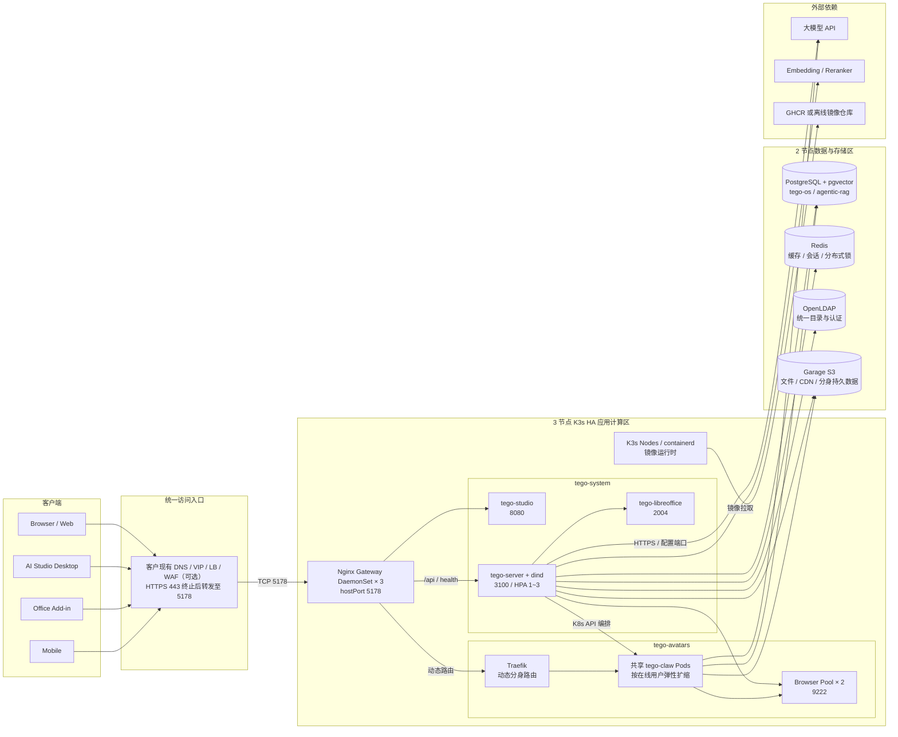
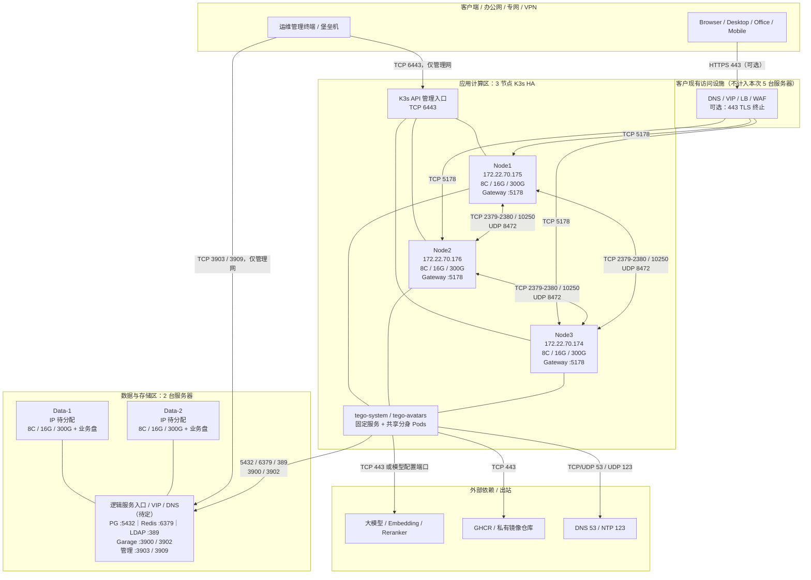

# TeGo-OS Avatar 数字分身生产环境推荐部署方案

> 文档状态：生产部署推荐基线<br>
> 适用版本：TeGo-OS Avatar `v2.16.0`<br>
> CPU 架构：`amd64`<br>
> 部署模式：5 台服务器，3 节点 K3s HA + 2 节点数据/存储<br>
> 适用范围：仅共享数字分身，不包含独享分身<br>
> 更新日期：2026-07-10

## 1. 文档目的

本文档依据《TeGo-OS 企业数字员工管理平台服务器资源申请表（Avatar 分身版）》和仓库当前部署配置，给出一套面向正式生产环境的推荐部署方案，用于：

- 服务器、网络、存储和安全评审；
- 实施团队制定部署计划；
- 运维团队准备监控、备份和故障处理方案；
- 上线前确认资源、端口、域名、证书和高可用策略；
- 上线后进行容量校准和扩容决策。

本文档区分三类内容：

| 类型 | 含义 |
| --- | --- |
| 已确定口径 | 已在资源申请表或当前配置中明确的版本、服务器数量、节点 IP、端口和资源参数 |
| 推荐设计 | 为满足生产稳定性、安全和可运维性给出的目标方案 |
| 待确认项 | 当前没有足够信息，必须在交付前由客户、实施和研发共同确认的内容 |

> [!IMPORTANT]
> 当前部署包中的 `02-install-k3s.sh`、`03-deploy.sh` 和 `infrastructure/docker-compose.yml` 仍以单一 `INFRA_NODE_IP` 为基础设施入口。资源申请表中的“两台数据/存储节点”是目标生产拓扑，不能直接运行默认脚本后就认定 PostgreSQL、Redis 或 Garage 已具备双机高可用。实施前必须完成双节点方案设计、脚本适配和故障切换验证。

## 2. 推荐方案结论

生产环境推荐申请和部署 5 台服务器：

| 区域 | 数量 | 主要职责 | 单台基线规格 |
| --- | ---: | --- | --- |
| K3s 应用计算区 | 3 台 | K3s 控制面、etcd、应用工作负载、共享数字分身 Pod、Browser Pool | 8 核 CPU、16 GB 内存、300 GB 系统盘 |
| 数据与存储区 | 2 台 | PostgreSQL、Redis、Garage、OpenLDAP | 8 核 CPU、16 GB 内存、300 GB 系统盘 + 业务数据盘 |
| 合计 | 5 台 | 应用计算与数据存储分离 | 40 核 CPU、80 GB 内存、1.5 TB 系统盘 + 业务数据盘 |

推荐的核心原则：

1. K3s 使用 3 个控制面兼工作节点，嵌入式 etcd 形成法定多数，可容忍 1 个 K3s 节点故障。
2. 数据组件退出 K3s 节点，部署在 Data-1、Data-2，避免数据库和对象存储与动态分身争抢资源。
3. 外部用户只访问统一业务入口 `TCP 5178`；数据库、缓存、LDAP 和 Garage 管理端口不得暴露到用户网段。
4. 共享数字分身按在线用户数弹性扩缩，策略范围支持 `0~10` 个副本、每副本默认目标 50 名在线用户；当前新建 shared 分身默认至少保留 1 个副本，显式设置 `minReplicas=0` 才启用 scale-to-zero。
5. 业务文件、配置和运行持久数据进入 PostgreSQL 与 Garage；K3s 工作负载使用的 `emptyDir` 只作为临时空间。
6. 高可用必须以故障切换测试为准，不能以“部署了两个实例”代替高可用验收。

## 3. 整体应用架构



### 3.1 组件职责

| 层级 | 组件 | 主要职责 |
| --- | --- | --- |
| 访问层 | Nginx Gateway | 统一暴露 `5178`，将 Studio、API、健康检查和 CDN 请求转发到内部服务 |
| 控制面 | tego-server | 数字分身、用户、权限、技能、模型、Gateway 和 K8s 副本生命周期管理 |
| 用户界面 | tego-studio | Avatar 管理和使用入口 |
| 文档能力 | tego-libreoffice | WPS / Office 文档转换 |
| 运行时 | tego-claw | 共享数字分身执行单元，承载聊天、工具调用、任务和 Gateway 运行时 |
| 浏览器能力 | tego-browser-pool | 为需要浏览器或 Computer Use 的分身提供 CDP 服务 |
| 数据层 | PostgreSQL + pgvector | 业务配置、权限、消息、运行元数据和向量数据 |
| 缓存层 | Redis | 缓存、会话、分布式锁和任务协调 |
| 目录服务 | OpenLDAP | 统一目录和认证相关数据 |
| 对象存储 | Garage | 文件、媒体、技能包、CDN 内容和分身持久数据 |

## 4. 网络部署拓扑



### 4.1 网络分区建议

建议至少划分以下安全区域：

| 网络区域 | 包含内容 | 访问原则 |
| --- | --- | --- |
| 用户访问区 | Browser、Desktop、Office、Mobile | 仅访问统一业务域名或 K3s 节点 `5178` |
| 管理区 | 堡垒机、运维终端、监控和备份系统 | 可访问 `6443`、SSH 和受限管理端口，必须采用白名单或 VPN |
| K3s 应用区 | Node1、Node2、Node3、Pod 网段 | 节点间端口双向开放；仅按需访问数据区和外部依赖 |
| 数据区 | Data-1、Data-2 | 只接受 K3s 网段和管理网的指定端口访问 |
| 外部依赖区 | 模型 API、镜像仓库、DNS、NTP | 采用出站白名单、代理或离线镜像 |

## 5. 服务器与操作系统规划

### 5.1 K3s 节点

| 节点 | IP | 角色 | CPU | 内存 | 系统盘 | 操作系统 |
| --- | --- | --- | ---: | ---: | ---: | --- |
| Node1 | `172.22.70.175` | K3s control-plane + etcd + worker | 8 核 | 16 GB | 300 GB | Ubuntu 22.04+ / Debian 12+，amd64 |
| Node2 | `172.22.70.176` | K3s control-plane + etcd + worker | 8 核 | 16 GB | 300 GB | Ubuntu 22.04+ / Debian 12+，amd64 |
| Node3 | `172.22.70.174` | K3s control-plane + etcd + worker | 8 核 | 16 GB | 300 GB | Ubuntu 22.04+ / Debian 12+，amd64 |

部署建议：

- 三台机器的 CPU 架构、操作系统大版本和时区保持一致；
- 使用固定 IP、固定主机名和可靠的内部 DNS；
- 时间同步必须正常，建议统一使用客户 NTP；
- 系统盘使用 SSD，预留容器镜像、K3s 数据、日志和临时文件空间；
- Node1、Node2、Node3 均运行工作负载，不把某一台永久当作唯一应用节点；
- `tego-server + dind` 使用临时空间，需持续监控磁盘和临时存储水位。

### 5.2 数据与存储节点

| 节点 | IP | 角色 | CPU | 内存 | 系统盘 | 业务盘 |
| --- | --- | --- | ---: | ---: | ---: | --- |
| Data-1 | 待分配 | PostgreSQL、Redis、Garage、OpenLDAP | 8 核 | 16 GB | 300 GB | 待容量评估 |
| Data-2 | 待分配 | PostgreSQL、Redis、Garage，按方案承担副本或备节点 | 8 核 | 16 GB | 300 GB | 待容量评估 |

数据节点建议：

- 系统盘与业务数据盘分离；
- PostgreSQL、Redis、Garage 和 LDAP 数据目录分别规划，避免互相占满磁盘；
- 业务盘优先使用企业级 SSD，并配置磁盘健康监控；
- 数据盘容量不得只按初始数据量估算，应计入副本、版本、临时文件、备份窗口和增长余量；
- Data-1、Data-2 的服务角色、VIP/DNS 和故障切换方式必须在部署前确定。

## 6. K3s 固定工作负载资源

以下资源口径来自资源申请表中的生产 overlay。请求值用于调度，Limit 是单 Pod 上限，两者不能混为实际稳定消耗。

| 服务 | 命名空间 | 类型 | 副本 | 端口 | Request CPU / Pod | Request 内存 / Pod | Limit CPU / Pod | Limit 内存 / Pod | 说明 |
| --- | --- | --- | --- | --- | ---: | ---: | ---: | ---: | --- |
| nginx-gateway | `tego-system` | DaemonSet | 3 | 5178 | 0.05 | 0.03125 Gi | 0.2 | 0.125 Gi | 每个 K3s 节点 1 个 |
| tego-server + dind | `tego-system` | Deployment + HPA | 1~3 | 3100 | 0.75 | 1 Gi | 4 | 6 Gi | `emptyDir` 25 Gi；临时存储上限约 24 Gi / Pod |
| tego-studio | `tego-system` | Deployment | 1 | 8080 | 0.1 | 0.0625 Gi | 0.5 | 0.25 Gi | Avatar Studio |
| tego-libreoffice | `tego-system` | Deployment | 1 | 2004 | 0.1 | 0.25 Gi | 2 | 2 Gi | 文档转换 |
| tego-browser-pool | `tego-avatars` | Deployment | 2 | 9222 | 0.5 | 1 Gi | 2 | 4 Gi | 每 Pod 另有 2 Gi 内存型 `emptyDir` |

### 6.1 固定工作负载合计

| 口径 | CPU | 内存 |
| --- | ---: | ---: |
| 最小请求值 | 2.10 核 | 3.41 Gi |
| HPA 最大副本下的请求值 | 3.60 核 | 5.41 Gi |
| 所有固定 Pod 的理论 Limit 合计 | 19.10 核 | 28.63 Gi |

上述合计不包括：

- K3s、etcd、Traefik、containerd 和操作系统开销；
- Data-1、Data-2 上的数据库和存储服务；
- 动态共享分身 `tego-claw` Pod；
- 日志、监控、备份代理、EDR 或安全扫描组件；
- 节点故障后工作负载迁移所需的冗余资源。

## 7. 共享数字分身容量规划

本版本仅提供共享数字分身。数字分身是配置实体，运行能力由 `avatar_replicas` 和 `tego-claw` Pod 承载。

### 7.1 当前默认参数

| 参数 | 默认值 | 含义 |
| --- | ---: | --- |
| `minReplicas` | 策略基线为 0；新建 shared 默认 1 | 当前 `AVATAR_SHARED_DEFAULT_MIN_REPLICAS` 未配置时为 1；显式设为 0 才允许 scale-to-zero |
| `maxReplicas` | 10 | 单个共享分身部署的最大副本数 |
| `targetUsersPerReplica` | 50 | 每副本目标在线用户数 |
| `scaleDownDelayMinutes` | 15 | 缩容冷却时间 |
| `idleTimeoutMinutes` | 30 | 空闲后缩容到 0 的等待时间 |
| `AVATAR_CPU_LIMIT` | 1 核 | 单个 Claw 主容器 CPU 上限，不包含 DinD sidecar |
| `AVATAR_MEMORY_LIMIT` | 2 Gi | 单个 Claw 主容器内存上限，不包含 DinD sidecar |
| `agentMaxConcurrent` | 16 | 单 Pod 全局同时运行的 agent turn 默认上限 |

扩缩容估算公式：

```text
desiredForLoad = ceil(connectedUsers / targetUsersPerReplica)
effectiveMin   = max(minReplicas, cronFloor)
desired        = clamp(desiredForLoad, effectiveMin, maxReplicas)
```

这里的 `connectedUsers` 是在线用户数，不是已分配用户总数；存在有效 cron 任务时，`cronFloor` 可能阻止副本缩到 0。

### 7.2 Claw 容器资源档位

建议提供 1C2G、2C4G、4C8G 三个标准档位。`AVATAR_CPU_LIMIT`、`AVATAR_MEMORY_LIMIT` 是平台全局默认值，每个数字分身还可以通过数据库中的 `resourceLimits` 单独覆盖，因此同一集群可以混合使用不同档位。

当前交付目录的 `config.env` 明确配置为 `AVATAR_CPU_LIMIT=1`、`AVATAR_MEMORY_LIMIT=2g`。`03-deploy.sh` 中的 `2C4G` 只是变量未设置时的脚本回退值；正式部署应以生成后的 `tego-config` ConfigMap 和实际 Claw Pod 资源为准。

K8s 共享分身 Pod 不只有 Claw 主容器，还包含默认 `0.5C / 512Mi` 的 DinD sidecar。当前编排策略为 Claw CPU Request 等于 Limit 的 50%，内存 Request 等于 Limit；DinD CPU Request 为 `0.25C`、内存 Request 为 `512Mi`。因此调度时应按完整 Pod 估算：

| 档位 | 全局默认变量 | 单分身 `resourceLimits` 覆盖示例 | Claw Request | Claw Limit | 含 DinD 的 Pod Request | 含 DinD 的 Pod Limit |
| --- | --- | --- | --- | --- | --- | --- |
| 1C2G | `1` / `2g` | `{"cpuLimit":"1","memoryLimit":"2g"}` | 0.5C / 2Gi | 1C / 2Gi | 0.75C / 2.5Gi | 1.5C / 2.5Gi |
| 2C4G | `2` / `4g` | `{"cpuLimit":"2","memoryLimit":"4g"}` | 1C / 4Gi | 2C / 4Gi | 1.25C / 4.5Gi | 2.5C / 4.5Gi |
| 4C8G | `4` / `8g` | `{"cpuLimit":"4","memoryLimit":"8g"}` | 2C / 8Gi | 4C / 8Gi | 2.25C / 8.5Gi | 4.5C / 8.5Gi |

上述 Pod 开销尚未包含短时 init container 峰值；DinD 还会申请 2Gi、限制 20Gi 临时存储。若调整 `AVATAR_DIND_CPU_LIMIT` 或 `AVATAR_DIND_MEMORY_LIMIT`，必须同步重算表中数据。

### 7.3 三档典型使用场景与用户量建议

以下用户量均指单个 Claw Pod 的**同时在线连接用户数**，不是平台注册用户数、已分配用户数，也不是同时运行的任务数。数值是压测前的工程起点，不是 SLA 或容量验收承诺。

| 推荐档位 | 主要使用场景 | 单 Pod 建议在线用户 | 建议初始 `targetUsersPerReplica` | 建议同时运行 turn | 推荐伸缩设置 |
| --- | --- | ---: | ---: | ---: | --- |
| 1C2G 轻量档 | 短问答、知识库查询、简单记忆、低频轻量工具调用 | 30~50 | 40 | 4~8 | 可接受冷启动时 `minReplicas=0` |
| 2C4G 标准档 | 通用生产助理、RAG、文件处理、记忆、偶发 Office 或浏览器工具 | 30~50 | 40 | 8~16 | 推荐 `minReplicas=1`，作为生产默认档 |
| 4C8G 增强档 | 长工具链、并行子代理、批量文档、频繁代码执行或浏览器自动化 | 20~40 | 30 | 12~16；压测后可到 24 | `minReplicas=1`，优先控制单 Pod 用户量 |

上表中 4C8G 的典型在线用户数没有简单按资源翻倍，是因为它面向更重的工作负载。若三种规格运行完全相同的任务，可以参考下面的换算矩阵；括号内是建议设置的 `targetUsersPerReplica`：

| 工作负载形态 | 典型行为 | 1C2G | 2C4G | 4C8G |
| --- | --- | ---: | ---: | ---: |
| 轻量聊天 | 短问答，平均每在线用户并发占用低 | 30~50（40） | 60~100（80） | 120~200（150） |
| 均衡助理 | 检索、记忆、文档和偶发工具链 | 15~25（20） | 30~50（40） | 60~100（80） |
| 重自动化 / 子代理 | 长工具链、并行子代理、浏览器或代码任务 | 5~10（8） | 10~20（15） | 20~40（30） |

用户量还受以下限制：

- 默认 `agentMaxConcurrent=16` 是单 Pod 全局同时运行 turn 的硬上限；增加 CPU 和内存不会自动提高该并发值；
- 4C8G 重自动化档若要把 `agentMaxConcurrent` 从 16 调到 24，必须同时验证模型限流、队列等待、子代理并发、CPU、内存和失败率；
- 单用户默认最多同时运行 4 个 turn、排队加运行最多 8 个，少量重度用户可能比大量只在线不操作的用户消耗更多容量；
- Browser Pool 当前只有 2 个副本。频繁浏览器自动化时，Browser Pool 可能先于 Claw 成为瓶颈；
- 模型响应时间、上下文长度、技能数量、文件大小和外部系统延迟都会改变实际容量。

### 7.4 档位选择建议

推荐采用以下决策口径：

1. **生产默认选择 2C4G**：适合大多数包含 RAG、记忆、文件和偶发工具调用的数字分身，初始设置 `targetUsersPerReplica=40`、`minReplicas=1`。
2. **纯聊天或成本优先选择 1C2G**：轻量场景初始设置 `targetUsersPerReplica=40`；可接受首次访问冷启动时设置 `minReplicas=0`。
3. **重自动化选择 4C8G**：不要因为资源更大就塞入更多重度用户，初始设置 `targetUsersPerReplica=30`、`minReplicas=1`，并通过压测决定是否提高 Claw 内部并发。
4. **优先横向扩副本，不优先无限放大单 Pod**：共享分身需要故障迁移和弹性伸缩，多个中等规格副本通常比单个超大 Pod 更容易调度和恢复。
5. **不要把所有分身统一设为 4C8G**：在本次 3 × 8C/16G 集群中，内存 Request 会显著降低可运行副本数。

生产上线前至少执行三组压测：

1. 轻量聊天：短请求、高在线、低工具调用；
2. 均衡助理：检索、记忆、文档处理和偶发浏览器调用；
3. 重自动化：长工具链、子代理、浏览器和并发文件处理。

压测应记录在线用户、同时运行 turn、P95/P99 延迟、队列等待/超时、模型限流、Pod CPU、工作集内存、OOM 和扩缩容耗时，据此调整 `targetUsersPerReplica`，不能只看请求成功率。

### 7.5 三节点集群容量边界

三台 K3s 节点物理资源合计为 24 核 CPU、48 GB 内存。为估算节点故障后的容量，采用以下保守假设：

- 任意 1 个 K3s 节点故障后，剩余 2 个节点共 16C / 32Gi；
- 剩余节点至少预留 4Gi 给操作系统、K3s、etcd、containerd 和系统组件；
- 固定工作负载按 HPA 最大副本的 Request 预留 3.60C / 5.41Gi；
- 不包含另行部署的监控、日志、安全代理，也未计算调度碎片。

按内存 Request 估算，故障状态下动态 Claw Pod 的生产建议总量如下。这里的数量是**整个集群所有共享分身的 Claw Pod 合计**，不是每个分身都可以分别使用这么多：

| 档位 | 单 Pod 调度内存 | 故障状态理论上限 | 建议生产总上限 | 按典型场景估算的在线用户总量 |
| --- | ---: | ---: | ---: | ---: |
| 1C2G | 2.5Gi | 9 个 | 8 个 | 轻量档约 `8 × 40 = 320` 人 |
| 2C4G | 4.5Gi | 5 个 | 4 个 | 标准档约 `4 × 40 = 160` 人 |
| 4C8G | 8.5Gi | 2 个 | 2 个 | 重自动化档约 `2 × 30 = 60` 人 |

不同档位的“典型场景”负载不同，因此上表不能直接横向比较用户数。如果全部运行相同的轻量聊天负载，按建议总上限估算分别约为 320、320、300 名同时在线用户，说明在总资源固定时，放大单 Pod 主要改变单副本能力，不会凭空增加集群总算力。

集群总用户量估算公式：

```text
单个分身峰值在线容量 = targetUsersPerReplica × 该分身可用副本数
集群峰值在线容量     = Σ(各分身 targetUsersPerReplica × 实际可用副本数)
```

因此：

- `maxReplicas=10` 是单个分身的策略上限，不是当前集群保证可调度 10 个任意规格 Pod；
- 多个共享分身同时扩容时，必须对所有分身的 Pod Request 求和；
- 同一分身的反亲和是软约束，节点故障时仍可能集中调度，应保留内存和临时存储余量；
- 若压测出现 Pod Pending、OOM、CPU throttling 或队列超时，应增加 K3s worker 节点、降低 `targetUsersPerReplica`，或限制单分身 `maxReplicas`；
- 扩容前优先观察实际 Request、Limit、工作集内存、队列等待和在线用户曲线，而不是只看分身数量。

## 8. 数据与存储高可用设计

### 8.1 当前交付脚本限制

当前离线包默认流程存在以下单节点假设：

- `02-install-k3s.sh` 将基础设施镜像和 Compose 文件分发到一个 `INFRA_NODE_IP`，并只在该节点启动 PostgreSQL、Redis、OpenLDAP 和 Garage；
- `infrastructure/docker-compose.yml` 中 PostgreSQL、Redis、OpenLDAP 和 Garage 均是单实例定义；
- `03-deploy.sh` 使用同一个 `INFRA_IP` 生成 PostgreSQL 和 Redis 地址；
- Garage S3 端点可通过 `AVATAR_S3_ENDPOINT` 覆盖，但双节点布局、复制和 VIP 不会自动创建。

推荐采用以下两条路径之一：

#### 路径 A：使用客户已有或独立建设的高可用数据服务（推荐）

1. 在 Data-1、Data-2 或客户现有数据平台上建设 PostgreSQL、Redis 和 S3；
2. 提供稳定的 VIP 或 DNS 服务地址；
3. 在部署前完成数据库、账号、桶、访问密钥和网络策略初始化；
4. 修改生成清单或部署脚本，使 PostgreSQL、Redis、S3 分别指向实际服务端点；
5. 禁用默认脚本中在 Node1 启动单机基础设施的步骤；
6. 通过主节点故障、网络中断和恢复演练完成验收。

#### 路径 B：适配离线部署包的双数据节点方案

实施团队需要增加并验证以下能力：

- 将 PostgreSQL、Redis、Garage 的主备/副本角色分布到 Data-1、Data-2；
- 将单一 `INFRA_NODE_IP` 拆分为 PostgreSQL、Redis、S3 和 LDAP 的独立服务端点；
- 增加 VIP、DNS 或代理层，避免应用直接绑定某台数据服务器；
- 增加复制状态检查、故障切换、回切和脑裂防护；
- 修改初始化脚本，确保数据库和 Garage 初始化只执行一次且可安全重试；
- 在交付包中固化改造后的配置、脚本和恢复说明。

### 8.2 各组件推荐策略

| 组件 | 当前镜像 / 端口 | 推荐生产目标 | 验收重点 |
| --- | --- | --- | --- |
| PostgreSQL | `pgvector/pgvector:pg17` / 5432 | 主备或成熟 HA 方案，提供统一 VIP/DNS；`tego-os`、`agentic-rag` 均启用 pgvector | 复制延迟、自动切换、回切、备份恢复、连接串稳定性 |
| Redis | `redis:7.4.1` / 6379 | 主从 + Sentinel 或客户托管服务；AOF 持久化 | 两个数据实例之外需要可靠仲裁，验证主从切换和客户端重连 |
| Garage | `dxflrs/garage:v2.2.0` / 3900、3902、3903 | 根据副本数、故障域和数据可靠性要求设计双节点或扩展节点方案 | 单节点故障、对象读写、元数据恢复、桶与密钥恢复 |
| OpenLDAP | `ghcr.io/zhama-ai/openldap:v1.1.0` / 389 | 若认证连续性要求高，配置复制或外接企业目录 | 目录备份、复制、认证回归、TLS 策略 |

> [!WARNING]
> 两台数据服务器并不天然等于所有组件都具备高可用。尤其是需要仲裁的组件，必须明确第三仲裁点、托管服务或人工切换策略。

## 9. 存储与备份规划

### 9.1 业务盘容量估算

资源申请表仅给出每台 300 GB 系统盘，数据库与 Garage 业务盘仍需评估。建议按以下口径估算：

```text
单节点业务盘容量 >=
  预计有效数据量 × 副本或版本系数
  + 备份暂存空间
  + 索引、WAL/AOF、压缩和临时空间
  + 至少 30% 增长余量
```

容量评估至少需要以下输入：

- 首年用户数、分身数和月增长率；
- 单用户消息、记忆、文件和媒体数据量；
- 技能包、模板和文档留存周期；
- PostgreSQL WAL、索引和向量数据增长；
- Garage 副本数和对象版本策略；
- 日备、周备、月备的保留周期；
- RPO、RTO 和恢复演练窗口。

### 9.2 推荐目录与隔离

当前 Compose 使用 `infrastructure/volumes/` 下的本地目录。生产环境建议将其映射到独立业务盘，并至少分开：

```text
/data/postgresql
/data/redis
/data/garage/meta
/data/garage/data
/data/openldap/database
/data/openldap/config
/backup/staging
```

### 9.3 备份基线

| 数据对象 | 推荐备份方式 | 建议频率 | 必须验证 |
| --- | --- | --- | --- |
| PostgreSQL | 连续归档或主备复制 + 定期全量备份 | 按 RPO 设计，至少每日形成可恢复点 | `tego-os`、`agentic-rag` 和 pgvector 扩展完整恢复 |
| Redis | AOF + 定期快照或由托管服务保障 | 按业务容忍度 | 重启、主从切换、AOF 恢复 |
| Garage | 副本策略 + 关键桶离线备份 + 配置/密钥备份 | 至少每日增量或按数据变化频率 | 对象、桶、访问密钥、元数据恢复 |
| OpenLDAP | 数据库与配置目录同时备份 | 每日 | 用户、组织、权限和配置恢复 |
| K3s | etcd 快照、部署清单、Secret 安全备份 | 每日或每次重要变更后 | 三节点集群恢复和应用重建 |

备份文件不得只保存在同一故障域。正式上线前至少完成一次全链路恢复演练并记录耗时。

## 10. 端口与防火墙矩阵

| 方向 | 源 | 目标 | 协议 | 端口 | 要求 |
| --- | --- | --- | --- | --- | --- |
| 业务入站 | 用户或现有 LB/WAF | K3s Nginx Gateway | TCP | 5178 | 唯一对外业务入口；可转发到任一或全部 K3s 节点 |
| HTTPS 入站（可选） | 用户 | 现有 LB/WAF | TCP | 443 | 推荐在客户现有设施终止 TLS，再转发到 5178 |
| K8s 管理 | 管理网 / VPN | K3s API Server | TCP | 6443 | 仅管理网白名单，禁止互联网开放 |
| K3s 节点间 | Node1 / Node2 / Node3 | etcd | TCP | 2379-2380 | 三节点双向开放 |
| K3s 节点间 | Node1 / Node2 / Node3 | Kubelet API | TCP | 10250 | 三节点双向开放 |
| K3s 节点间 | Node1 / Node2 / Node3 | Flannel VXLAN | UDP | 8472 | 默认 VXLAN 网络需要 |
| K3s 节点间（可选） | Node1 / Node2 / Node3 | Flannel WireGuard | UDP | 51820 | 仅启用 WireGuard backend 时开放 |
| 数据访问 | tego-server / 分身 Pod | PostgreSQL | TCP | 5432 | 仅 K3s 网段访问 Data-1/Data-2 或 PG VIP |
| 数据访问 | tego-server | Redis | TCP | 6379 | 仅 K3s 网段访问 Data-1/Data-2 或 Redis VIP |
| 认证访问 | tego-server | OpenLDAP | TCP | 389 | 仅 K3s 网段访问；启用 TLS 时同步调整证书和端口 |
| 对象存储 | 服务 / 分身 Pod / Nginx | Garage S3 / Web | TCP | 3900 / 3902 | 仅 K3s 网段开放 |
| 存储管理 | 管理网 / VPN | Garage Admin / WebUI | TCP | 3903 / 3909 | 仅管理网白名单 |
| 集群内部 | K8s Pod | Server / Studio / LibreOffice / Browser | TCP | 3100 / 8080 / 2004 / 9222 | ClusterIP 内部访问，不直接对外开放 |
| 模型出站 | tego-server / 分身 Pod | 大模型、Embedding、Reranker | TCP | 443 或配置端口 | 采用域名、IP 或代理白名单 |
| 镜像出站 | K3s 节点 | GHCR / 私有仓库 | TCP | 443 | 离线环境改用本地镜像包或私有仓库 |
| 基础服务 | 所有节点 | DNS / NTP | TCP/UDP | 53 / 123 | 使用客户统一基础服务 |

防火墙采用默认拒绝策略，只开放矩阵中的必要方向。SSH、数据库管理、Garage WebUI、K8s API 必须通过管理网、VPN 或堡垒机访问。

## 11. 安全加固建议

### 11.1 访问入口

- 生产环境优先使用正式域名和 HTTPS；
- 复用客户现有 LB/WAF 时，明确健康检查路径、会话超时和 WebSocket 支持；
- 只对用户网段开放业务入口，不暴露 Pod、ClusterIP 和数据组件端口；
- K3s API `6443` 只允许管理网和自动化部署节点访问。

### 11.2 凭据与密钥

- 修改 PostgreSQL、Redis、LDAP、默认管理员和 Garage 的默认密码；
- API Key、数据库密码、S3 密钥和 JWT/RSA 私钥不得写入交付文档或普通日志；
- K8s Secret、离线配置包和备份介质应加密保存并限制访问；
- 建立密钥轮换、吊销和应急更换流程。

### 11.3 数据安全

- PostgreSQL、Redis、LDAP、Garage 管理端口只对受控网段开放；
- 当前基础设施 Compose 中 LDAP TLS 默认关闭，生产环境应评估启用 TLS 或确保链路处于严格隔离的可信网络；
- 数据备份与生产数据使用不同权限、不同介质和不同故障域；
- 对数据库导出、对象下载和管理员操作保留审计记录。

### 11.4 主机与容器

- 统一补丁基线、时区、NTP、EDR 和漏洞扫描策略；
- 限制 Docker、containerd 和 kubeconfig 的本地访问权限；
- 禁止将容器运行时和 K3s 管理端口暴露到用户网段；
- 为系统盘、业务盘、inode、容器镜像和临时目录设置告警。

## 12. 推荐部署实施流程

### 阶段 0：交付门禁确认

部署前必须完成：

- [ ] Data-1、Data-2 IP、主机名和网络区域确认；
- [ ] PostgreSQL、Redis、Garage、OpenLDAP 的部署和高可用方式确认；
- [ ] PostgreSQL、Redis、S3 的 VIP/DNS/连接地址确认；
- [ ] 业务盘容量、RAID/LVM、挂载点和文件系统确认；
- [ ] 外部域名、证书、LB/WAF 和 `5178` 转发策略确认；
- [ ] 模型服务、Embedding、Reranker、镜像仓库和代理策略确认；
- [ ] RPO、RTO、备份周期和恢复责任人确认；
- [ ] 日志、监控、审计和安全组件是否另行申请确认。

### 阶段 1：基础环境准备

1. 安装 Ubuntu 22.04+ 或 Debian 12+；
2. 配置固定 IP、主机名、DNS、NTP 和时区；
3. 配置管理账号、SSH 密钥和堡垒机策略；
4. 挂载数据盘并设置目录权限；
5. 配置防火墙和安全组；
6. 验证 3 个 K3s 节点之间的端口连通性；
7. 验证 K3s 区到数据区和外部依赖的访问。

### 阶段 2：数据与存储服务部署

1. 按选定方案部署 PostgreSQL、Redis、Garage 和 OpenLDAP；
2. 创建 `tego-os`、`agentic-rag` 数据库并启用 `vector` 扩展；
3. 创建 Garage 桶 `tego-storage` 和应用访问密钥；
4. 配置 Redis AOF、主从或 Sentinel；
5. 配置备份任务和备份存储；
6. 完成 Data-1 故障、Data-2 故障和服务恢复测试；
7. 固化应用使用的 VIP/DNS 和连接地址。

> 不要在双数据节点目标方案中直接执行默认 `02-install-k3s.sh` 的基础设施阶段，除非交付包已完成适配并通过测试。默认脚本会把基础设施启动在单一 `INFRA_NODE_IP`。

### 阶段 3：K3s HA 集群部署

1. 在 Node1 初始化 K3s server 和嵌入式 etcd；
2. Node2、Node3 加入同一 K3s server 集群；
3. 验证三个节点均为 `Ready`；
4. 验证 etcd、Kubelet 和 Flannel 网络；
5. 配置 GHCR 凭据、私有仓库或离线镜像；
6. 配置管理端访问 K3s API 的 VIP/DNS 或受控入口；
7. 执行 K3s 集群验证脚本。

基础检查示例：

```bash
kubectl get nodes -o wide
kubectl get pods -A
kubectl get storageclass
kubectl cluster-info
```

预期结果：3 个节点均为 `Ready`，系统 Pod 无持续重启，Pod 网络和 DNS 正常。

### 阶段 4：TeGo-OS 应用部署

1. 将版本和架构固定为 `v2.16.0`、`amd64`；
2. 设置 Node1、Node2、Node3 IP；
3. 设置外部访问地址 `EXTERNAL_URL`；
4. 将 PostgreSQL、Redis、S3 和 LDAP 指向已确认的服务端点；
5. 修改部署脚本中对单一 `INFRA_IP` 的硬编码替换，或使用已适配的交付包；
6. 加载镜像并应用 K8s 资源；
7. 等待 `tego-system` 和 `tego-avatars` 工作负载就绪；
8. 初始化管理员、LDAP、Garage 密钥和数据库内容；
9. 验证三个节点的 `5178` 均可访问。

示例检查：

```bash
kubectl get pods -n tego-system -o wide
kubectl get pods -n tego-avatars -o wide
kubectl get svc -n tego-system
kubectl get svc -n tego-avatars
kubectl get hpa -n tego-system
curl http://172.22.70.175:5178/health
curl http://172.22.70.176:5178/health
curl http://172.22.70.174:5178/health
```

### 阶段 5：功能、容量和故障演练

至少验证：

- 用户登录、组织和权限；
- 数字分身创建、审批、启用和禁用；
- 共享分身连接、聊天、技能、记忆和文件；
- Browser Pool、LibreOffice 和模型调用；
- PostgreSQL、Redis、Garage、LDAP 的数据持久化；
- 分身从 0 扩到多个副本并缩回 0；
- Node1、Node2、Node3 任一节点故障后的服务连续性；
- Data-1 或 Data-2 故障后的数据服务切换；
- 备份恢复和回切；
- LB/WAF、WebSocket、超时和大文件上传。

## 13. 上线验收清单

### 13.1 资源与网络

- [ ] 5 台服务器规格与申请表一致；
- [ ] Node1、Node2、Node3 IP 与文档一致；
- [ ] Data-1、Data-2 IP、VIP/DNS 已登记；
- [ ] 数据业务盘容量、挂载点和告警已确认；
- [ ] 用户网只开放 `5178` 或外部 LB/WAF 的 `443`；
- [ ] `6443`、`3903`、`3909` 仅管理网可达；
- [ ] K3s 节点间端口和数据访问端口均通过连通性测试；
- [ ] DNS、NTP、镜像仓库和模型服务可达。

### 13.2 K3s 与应用

- [ ] 3 个 K3s 节点均为 `Ready`；
- [ ] etcd 健康且已配置快照；
- [ ] `tego-system` 和 `tego-avatars` Pod 无异常重启；
- [ ] Nginx Gateway 在三个节点均监听 `5178`；
- [ ] tego-server HPA、Browser Pool 和 LibreOffice 正常；
- [ ] 共享分身可创建副本、连接 Gateway 并执行任务；
- [ ] 动态分身扩缩容和 idle 回收符合策略。

### 13.3 数据与高可用

- [ ] PostgreSQL 两个数据库及 `vector` 扩展可用；
- [ ] PostgreSQL 主备、VIP/DNS、自动切换和回切通过测试；
- [ ] Redis AOF、复制和故障切换通过测试；
- [ ] Garage 对象读写、节点故障和恢复通过测试；
- [ ] LDAP 数据持久化和恢复通过测试；
- [ ] 全量备份、增量/日志备份和异机恢复通过测试；
- [ ] 实际 RPO、RTO 达到项目要求。

### 13.4 安全与运维

- [ ] 默认密码和初始密钥已更换；
- [ ] Secret、kubeconfig、S3 密钥和备份介质权限已收敛；
- [ ] 域名、证书和 WebSocket 策略已验证；
- [ ] 日志、监控、告警、审计和巡检责任已明确；
- [ ] 应急联系人、故障升级、变更和回滚流程已确认；
- [ ] 部署版本、镜像摘要、配置和验收结果已归档。

## 14. 监控与告警建议

资源申请表当前未包含独立日志和监控平台。正式生产建议至少覆盖：

| 对象 | 关键指标或事件 |
| --- | --- |
| 主机 | CPU、内存、Load、磁盘容量、inode、IO 延迟、网络丢包、时间同步 |
| K3s | 节点 Ready、etcd 健康、Pod Pending/Restart/OOM、调度失败、证书有效期 |
| tego-server | 请求错误率、延迟、HPA 副本、队列、数据库/Redis/S3 连接错误 |
| 共享分身 | 当前副本、期望副本、在线用户、扩缩容事件、队列拒绝、Gateway 心跳 |
| PostgreSQL | 连接数、慢查询、锁、复制延迟、WAL、磁盘、备份结果 |
| Redis | 内存、连接数、命中率、AOF、复制状态、主从切换 |
| Garage | 节点状态、对象读写错误、容量、元数据、复制和管理 API |
| 备份 | 最近成功时间、备份大小、校验结果、恢复演练结果 |

建议告警至少覆盖：

- 节点不可用或 etcd 失去法定多数；
- 数据盘使用率达到 70%、80%、90% 分级阈值；
- Pod 持续 Pending、OOMKilled 或 CrashLoopBackOff；
- PostgreSQL/Redis/Garage 复制异常；
- 扩缩容期望副本与实际副本长期不一致；
- Garage、数据库或备份任务连续失败；
- 证书、密钥或备份保留期即将到期。

## 15. 变更、升级与回滚

生产变更建议遵循：

1. 变更前完成数据库、Garage、LDAP 和 K3s etcd 备份；
2. 固化当前版本、镜像摘要、K8s 清单和配置；
3. 在测试环境验证数据库迁移和回滚路径；
4. 在维护窗口执行，先数据层兼容检查，再应用层滚动升级；
5. 观察错误率、Pod 状态、扩缩容和数据复制；
6. 触发回滚条件时停止继续变更并按预案恢复；
7. 变更后执行功能回归、数据校验和备份验证。

回滚预案必须包含：

- 应用镜像和 K8s 清单回滚；
- 数据库迁移的前滚修复或恢复策略；
- Garage 和 LDAP 配置恢复；
- K3s 节点或 etcd 恢复；
- 外部 LB/WAF 路由回切；
- 失败期间的用户通知和数据一致性检查。

## 16. 上线前待确认清单

| 项目 | 当前状态 | 责任方 | 上线门禁 |
| --- | --- | --- | --- |
| Data-1、Data-2 IP | 待分配 | 客户网络 | 必须完成 |
| PostgreSQL HA 方案与 VIP/DNS | 待设计 | 实施 / DBA | 必须完成 |
| Redis HA 与第三仲裁点 | 待设计 | 实施 / DBA | 必须完成 |
| Garage 副本、故障域和恢复方案 | 待设计 | 实施 / 存储 | 必须完成 |
| OpenLDAP 是否需要高可用和 TLS | 待确认 | 客户 IAM / 实施 | 上线前确认 |
| 数据业务盘容量 | 待评估 | 客户 / 实施 | 必须完成 |
| 外部域名、证书和 LB/WAF | 待确认 | 客户网络 / 安全 | 必须完成 |
| 模型服务和出站白名单 | 待确认 | 客户网络 / AI 平台 | 必须完成 |
| 日志、监控和审计平台 | 未包含在资源申请中 | 客户运维 | 必须给出处置方案 |
| RPO、RTO 和恢复演练 | 待确认 | 客户 / 实施 | 必须完成 |
| 双数据节点部署脚本适配 | 当前脚本仍为单基础设施节点 | 研发 / 实施 | 必须完成或改用外部 HA 服务 |

## 17. 依据与相关文档

- [Avatar 分身版服务器资源申请表](../../../outputs/tego-os-avatar-resource-application/TeGo-OS企业数字员工管理平台服务器资源申请表_Avatar分身版.xlsx)
- [数字分身技术架构](../../architecture/digital-avatar.md)
- [共享数字分身容量模型](../../design/elastic-scaling/capacity-model.md)
- [K8s 生产部署说明](../../../apps/deploy/product/tego/k8s/README.md)
- [K8s 离线包部署指南](../../../apps/deploy/product/tego/k8s/deploy-k8s.md)
- [K8s 当前交付配置](../../../apps/deploy/product/tego/k8s/config.env)
- [K3s 高可用集群部署指南](../../../apps/deploy/product/tego/k8s/k3s/README.md)
- [基础设施 Docker Compose](../../../apps/deploy/product/tego/k8s/infrastructure/docker-compose.yml)
- [数字分身默认扩缩策略](../../../apps/server/src/models/digital-avatars.ts)
- [数字分身资源覆盖解析](../../../apps/server/src/services/avatar/avatar-config-resolver.ts)
- [K8s Claw Pod 资源计算](../../../apps/server/src/services/orchestrator/kubernetes.orchestrator.ts)
